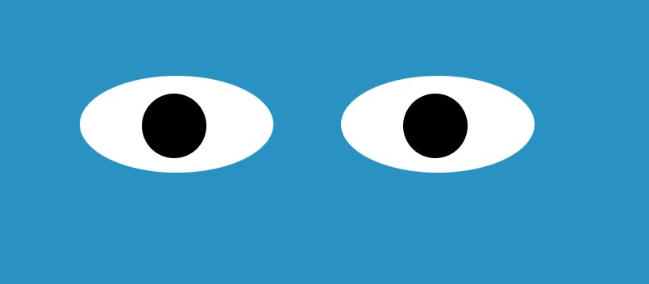

<a href="https://github.com/TennWilliams/Eyes"> Eyes Exercise </a>
## The Watching Eyes

In this exercise I created an eye that follows the mouse cusor by using CSS to create and styling the eye and JavaScript function on mouse move to make the eyes move around the creeen as you move your mouse cusor.  

## Future improvments 
I would like to change the eye's color on mouse click.

## Run Code
To run this code you must clone this code in VS code and then open the HTML file in a web broswer.

License through MIT
